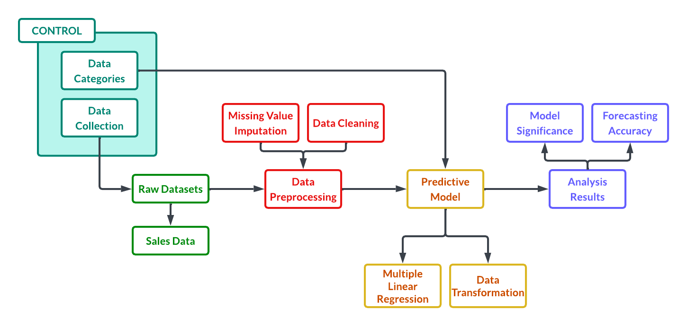

```{r setup, include=FALSE}
knitr::opts_chunk$set(echo = TRUE)

# Library
library(RKaggle)    # Access Kaggle
library(readr)      # File reading
library(dplyr)      # Data manipulation
library(tidyr)      # Data reshaping
library(stringr)    # String manipulation
library(forcats)    # Handling categorical factors
library(purrr)      # Functional programming
library(mice)       # Bayesian Linear Regression imputation
library(caret)      # Data splitting and pre-processing
library(car)        # Variance Inflation Factor (VIF)
library(lmtest)     # Testing for heteroscedasticity (Breusch-Pagan-Godfrey)
library(olsrr)      # Comprehensive OLS regression diagnostics
library(ggplot2)    # Main plotting engine
library(corrplot)   # Correlation matrices
library(knitr)      # Better summary table
library(broom)      # For the tidy() function of the model summary

set.seed(5)
```

# Abstract
Provide a concise summary of the study including purpose, methods, results, and conclusions (150–250 words).

# Chapter 1: Introduction

## Background of the Study

&nbsp;&nbsp;&nbsp;&nbsp;Global sales prediction plays an important role in helping businesses make informed decisions related to marketing strategies, inventory management, budgeting, and future business planning. Many organizations rely on predictive models such as Multiple Linear Regression to analyze trends and forecast sales performance using historical and market-related data. However, one of the common challenges in predictive analytics is the presence of missing data within datasets. Missing values may occur due to incomplete records, human error, system failures, or inconsistent data collection processes. When these missing values are not properly handled, they can negatively affect the accuracy, consistency, and reliability of sales prediction models, leading to poor decision-making and inaccurate forecasts.

&nbsp;&nbsp;&nbsp;&nbsp;This research focuses on examining the effect of missing value handling on improving global sales prediction using Multiple Linear Regression. Specifically, it aims to understand why missing data reduces model performance and how different data cleaning techniques can enhance predictive accuracy. It also highlights the significance of proper data preparation in machine learning and statistical analysis. By identifying effective preprocessing methods, the research can help businesses, researchers, and data analysts develop more reliable prediction models and improve the quality of data-driven decisions in global sales forecasting.

## Statement of the Problem

&nbsp;&nbsp;&nbsp;&nbsp;This study aims to evaluate the impact of data cleaning and model transformation on the predictive accuracy and reliability of Multiple Linear Regression in estimating global video game sales by addressing the following research questions:

1. What is the effect of missing value handling on improving global sales prediction using Multiple Linear Regression?

2. Why does missing data reduce the accuracy and reliability of sales prediction models?

3. How does applying data cleaning techniques improve the performance of the Multiple Linear Regression model?

## Objectives of the Study

### General Objective

- To investigate the effect of missing value handling on improving global sales prediction using Multiple Linear Regression.

### Specific Objectives

- To determine how missing data affects the accuracy and reliability of sales prediction models.

- To implement and assess data imputation strategies to prevent the loss of valuable data caused by deleting incomplete rows.

## Significance of the Study
&nbsp;&nbsp;&nbsp;&nbsp;This study mainly benefits stakeholders who utilize predictive analysis to guide data-driven decision making. By emphasizing the influence of missing data found within datasets used, as well as determining the impact it has to the model’s efficacy, the following groups stand to gain:

- Business Organizations: Companies heavily rely on these predictive models to analyze trends and forecast sales performance. By proving how the influence of missing data skews the results of analysis, the marketing and sales departments of these organizations can refine and regulate their data collection procedures. These practices upholding data integrity can ensure quality regarding sales forecasting and, in turn, aid in their future executive business decisions and resource allocation.

- Data Analysts: This paper can serve as a benchmark to creating and optimizing new prediction models, especially addressing the challenges posed by missing values in their datasets. Analysts can utilize these findings to theorize more of these sophisticated strategies to create more robust, reliable, and statistically accurate analytical tools.

- Researchers: Practitioners and professionals under the field of data science and econometrics can refer to this paper. It offers a framework for future studies to compare different machine learning algorithms or imputation techniques surrounding the Multiple Linear Regression model used here.

## Scope and Limitations

&nbsp;&nbsp;&nbsp;&nbsp;This research focuses on predicting global video game sales by comparing two data-handling methods which are deleting missing rows and using the Bayesian Linear Regression imputation. The analysis is specifically performed using Multiple Linear Regression within the R programming environment. The primary goal is to determine which data-handling technique leads to a more accurate and reliable prediction model.

\newpage

# Chapter 2: Review of Related Literature

## Related Studies

&nbsp;&nbsp;&nbsp;&nbsp;In a study focused specifically on video game sales data from Kaggle, Affan et al. (2024) developed a machine learning-based sales prediction model using several regression algorithms. Their model made use of regression algorithms, including Linear Regression, Ridge Regression, and Gradient Boosting Regressor, to forecast worldwide video game sales based on variables such as genre, platform, publishers, critic reviews, and user ratings. Their work demonstrates that the same video game sales dataset used in this study has been applied in prior research, validating its academic relevance.

&nbsp;&nbsp;&nbsp;&nbsp;Separately, a study on predicting video game sales using supervised learning from the same Kaggle dataset highlighted the impact of missing data on model outcomes. After downloading the dataset, the researcher dropped rows with empty values or filled in missing values to standardize the columns before applying regression modeling, noting that the dataset contained missing score fields for some video games, which posed challenges to prediction reliability. This finding directly parallels the core concern of this research, that unhandled missing data undermines prediction accuracy. Du (2025).

&nbsp;&nbsp;&nbsp;&nbsp;Ahmad et al. (2024) conducted a comprehensive review of machine learning applications specifically for missing value imputation. Their analysis sought to enhance researchers' understanding of MVI methods and facilitate the development of robust interventions in data preprocessing for data analytics, elucidating the strengths and limitations of different ML algorithms in imputing missing values across different types of data. This reinforces the idea that the choice of imputation technique has measurable consequences for downstream model performance.

## Related Literature

### Multiple Linear Regression

&nbsp;&nbsp;&nbsp;&nbsp;Multiple Linear Regression is a fundamental statistical technique used to model the relationship between one dependent variable and two or more independent variables. According to Fiveable (2024), the goal of MLR is to find the line of best fit that minimizes the sum of squared residuals, where the model takes the form $Y = \beta_0 + \beta_1X_1 + \beta_2X_2 + \dots + \beta_kX_k + \epsilon$, with each slope coefficient representing the change in the dependent variable for a one-unit change in the corresponding independent variable, holding all others constant.

&nbsp;&nbsp;&nbsp;&nbsp;The reliability of MLR estimates depends on a set of classical assumptions known as the Gauss-Markov conditions. As explained by Jim (n.d.), the Gauss-Markov theorem states that if a linear regression model satisfies the classical assumptions, then Ordinary Least Squares (OLS) regression produces unbiased estimates that have the smallest variance of all possible linear estimators. When these assumptions are violated, for instance, due to missing data introducing bias or inconsistency into the dataset, the estimates produced by the model can no longer be guaranteed to be optimal.

### Missing Data Mechanisms

&nbsp;&nbsp;&nbsp;&nbsp;The theoretical foundation for understanding missing data was established by Rubin (1976) and later expanded upon by Little and Rubin. As described by the Statistical Consulting Centre of the University of Melbourne (n.d.), data is considered Missing Completely at Random (MCAR) if the probability of being missing does not depend on the values of any of the variables in the data, Missing at Random (MAR) if the probability of being missing depends only on observed data, and Missing Not at Random (MNAR) if the probability of missingness is related to the values that would have been observed had the data not been missing. Understanding which mechanism governs the missing values in a dataset is critical because it determines which imputation strategies are appropriate and what biases might be introduced if missing data is simply ignored.

&nbsp;&nbsp;&nbsp;&nbsp;Further elaborated by APXML (n.d.), the MCAR assumption is the simplest scenario, where missingness is purely random and does not have a systematic cause related to the data, while MAR is often a reasonable working assumption when MCAR seems too simplistic and there is no strong domain reason to suspect MNAR. According to ScienceDirect (n.d.), the use of inappropriate methods for handling missing data can lead to bias in parameter estimates, bias in standard errors and test statistics, and inefficient use of data, all of which directly degrade the predictive accuracy of a regression model.

### Data Preprocessing and Model Performance

&nbsp;&nbsp;&nbsp;&nbsp;Data preprocessing refers to a set of techniques applied to raw data before it is used for analysis or model training. As highlighted by Lee (2025), simple steps like normalization and feature scaling can have dramatic effects on model performance, and only including features that contribute significantly to prediction accuracy is essential to building a reliable regression model. In the context of sales prediction, preprocessing steps such as handling missing values, removing duplicate records, and encoding categorical variables are necessary to ensure that the dataset meets the assumptions required for valid regression analysis.

&nbsp;&nbsp;&nbsp;&nbsp;Supporting this, research cited in the IJEDR (2025) by Mehta and Sharma (2022) demonstrated that removing outliers and cleaning data improved model performance significantly, while Singh and Gupta (2022) compared various regression models and found that proper preprocessing influenced predictive results across model types. These findings collectively support the rationale of this study: that systematic application of data cleaning techniques prior to fitting a Multiple Linear Regression model will yield measurably improved performance in global sales prediction.

## Conceptual Framework

```{r conceptual-framework, echo=FALSE, out.width="80%", fig.align="center", fig.cap="Conceptual Framework of the Study"}

```

&nbsp;&nbsp;&nbsp;&nbsp;The conceptual framework of this case study describes a flow of events detailing the different phases of data analysis it proposes.

&nbsp;&nbsp;&nbsp;&nbsp;At the start of the research process, the raw datasets, primarily consisting of sales data records, are aggregated into the Input Phase. The Data Collection procedures inherent to the source influence the initial integrity of this data, essential to determining the mechanism of missing records. Afterwards, the raw data undergoes Data Preprocessing. Missing Value Imputation (MVI) and Data Cleaning procedures are performed to eliminate and mitigate the impact of data loss and satisfy the assumptions of linear modeling. 

&nbsp;&nbsp;&nbsp;&nbsp;These refined inputs are sent to the Predictive Model, utilizing the Multiple Linear Regression model and Data Transformation techniques which will be discussed further in the methodology of this paper. Data Categories defined in the dataset, such as platform and genre, are utilized as control variable, taken into account to ensure the model’s validity and scrutinize market biases. Once all processes are finished, results of the analysis are printed, presented and evaluated through the lens of model significance and accuracy of variable forecasting, especially determining and confirming the reliability of the model in predicting global video game sales.

\newpage

# Chapter 3: Methodology

## Research Design

&nbsp;&nbsp;&nbsp;&nbsp;This study employs a quantitative explanatory research design to investigate the determinants of video game commercial success based on global sales. The study utilizes the Video Game Sales dataset from Kaggle, comprising over 16,000 entries. Data pre-processing was conducted using R, which involved data imputation to address missing values and a 70/30 train-test split. This partitioning ensures that the predictive model is trained on 70% of the data and validated against a 30% hold-out set to assess its generalizability.

&nbsp;&nbsp;&nbsp;&nbsp;The primary analytical framework is Multiple Linear Regression. To ensure the reliability of the regression coefficients and $p$-values, the model is evaluated against the four classical linear regression assumptions:

1. Normality - This refers to the distribution of the residuals. This study utilizes the Kolmogorov-Smirnov test to ensure that the error terms follow a normal distribution, which is essential for valid hypothesis testing.

2. Homoscedasticity - It is the spread of your residuals should be the same across all levels of your predicted values. This study utilizes the Breusch-Pagan-Godfrey test; a violation (heteroscedasticity) would suggest that the model’s standard errors are biased.

3. Multicollinearity - This occurs when two or more of your independent variables are too highly correlated with each other. This study calculates the Variance Inflation Factor of each predictor to check if there are any high correlation between predictors.

4. Independence - This assumes that the residual for one observation is not related to the residual of another. This study will utilize the Durbin-Watson test to check for autocorrelation.

## Data Collection

&nbsp;&nbsp;&nbsp;The dataset utilized in this study was collected from Kaggle, named Video Game Sales with Ratings by Rush Kirubi from https://www.kaggle.com/datasets/rush4ratio/video-game-sales-with-ratings. The following variables are chosen for the model.

```{r, echo=FALSE, message=FALSE, warning=FALSE}
# Get data from Kaggle using RKaggle
url <- "rush4ratio/video-game-sales-with-ratings"
dataset <- RKaggle::get_dataset(url) %>%
        mutate(across(everything(), ~ ifelse(.x %in% c("", "NA", "N/A"), NA, .x)))

# Get data row count
data_row_count <- nrow(dataset)

set.seed(5)

# Drop all sales except global
dataset <- cbind(dataset[,-c(6:10)],dataset$Global_Sales)
dataset$Year_of_Release <- 2016 - as.numeric(dataset$Year_of_Release)
names(dataset)[3] <- "Game_Age"
names(dataset)[12] <- "Global_Sales"

# Convert User Score to numeric
dataset <- dataset %>% mutate(User_Score = as.numeric(na_if(User_Score, "tbd")))
dataset$User_Score <- dataset$User_Score * 10

# Select only the columns you need by name
keep_columns <- c("Global_Sales", "Platform", "Game_Age", "Genre", "Critic_Score", "Critic_Count", "User_Score", "User_Count", "Rating")

# Overwrite the data with only those columns
data_subset <- dataset[, keep_columns]

data_subset$Platform <- as.factor(data_subset$Platform)
data_subset$Genre <- as.factor(data_subset$Genre)
data_subset$Rating <- as.factor(data_subset$Rating)

data_display <- data_subset

table_column_labels <- c("Sales", "Platform", "Age", "Genre", "CriticScore", "CriticCount", "UserScore", "UserCount", "Rating")

# Show the table before imputation
knitr::kable(head(data_subset, 6),
             col.names = table_column_labels,
             caption = "First Six Rows of Video Game Sales Data Overview")
```

## Data Imputation

&nbsp;&nbsp;&nbsp;&nbsp;The dataset have missing values *(NA)*. To address the missing values, the dataset was imputed using a Predictive Mean Matching model.

```{r, echo=FALSE, message=FALSE, warning=FALSE}
# Predictive Mean Matching (PMM)
imputed_data <- mice(data_subset, 
                    method = "pmm", 
                    m = 1,
                    maxit = 5,
                    seed = 123, 
                    printFlag = FALSE)

# Complete the dataset
data <- complete(imputed_data, 1)

# Show the table after imputation
knitr::kable(head(data, 6),
             col.names = table_column_labels,
             caption = "First Six Rows of the Data After Imputation")
```

## Variables Description

### Dependent Variable

- **Global_Sales**: Sales around the globe.

### Independent Variables

- **Platform**: Game console.

- **Game_Age**: Age of the game from year of release to the year 2016.

- **Genre**: Game type (action, sports, exc.)

- **Critic_Score** Aggregate score compiled by Metacritic staff.

- **Critic_Count**: The number of critics used in coming up with the Criticscore.

- **User_Score** Score by Metacritic's subscribers.

- **User_Count**: Number of users who gave the userscore.

- **Rating**: The ESRB ratings.

## Data Analysis Techniques

- **Descriptive Statistics**
  
&nbsp;&nbsp;&nbsp;&nbsp;To analyze the dataset's core characteristics, descriptive statistics were first employed alongside outlier visualization to identify extreme data points that could distort the overall analysis. This was followed by a five-number summary (minimum, first quartile, median, third quartile, and maximum) to provide a comprehensive overview of the data's distribution, which was instrumental in pinpointing significant skewness within the Global_Sales figures. Finally, frequency distributions were used to evaluate categorical variables such as Platform, Genre, and Rating, effectively highlighting the most prevalent categories and trends across the dataset.

- **Inferential Statistics**
  
&nbsp;&nbsp;&nbsp;&nbsp;For the inferential statistics phase, Multiple Linear Regression served as the primary technique to model the relationship between global sales and various predictors, including platform, game age, genre, scores, and ratings. To address the right-skewness observed during the descriptive analysis, a log-transformation was applied to the dependent variable, $log(y)$, to stabilize variance and normalize the distribution. The model’s validity was assessed through hypothesis testing with a significance level of $\alpha = 0.05$; predictors with $p < 0.05$ were deemed significant, while diagnostic tests—such as Kolmogorov-Smirnov for normality, Breusch-Pagan-Godfrey for homoscedasticity, and Durbin-Watson for independence required $p > 0.05$ to confirm the model met all necessary statistical assumptions. Finally, the Coefficient of Determination ($R^2$ and Adjusted $R^2$) was used to evaluate the goodness-of-fit and assist in variable selection, quantifying the proportion of variance in sales successfully explained by the model.

\newpage

# Chapter 4: Results and Discussion

## Descriptive Statistics

```{r, echo=FALSE, warning=FALSE, message=FALSE}
# Get all numeric columns
keep_columns <- c("Global_Sales", "Game_Age", "Critic_Score", "Critic_Count", "User_Score", "User_Count")
sub_data <- data[, keep_columns]
clean_summary <- as.data.frame(unclass(summary(sub_data)))
```

```{r, echo=FALSE, warning=FALSE, message=FALSE, fig.cap="Outlier Detection across all Numerical Predictors"}
# Render boxplot of numeric columns
sub_data %>%
  pivot_longer(everything()) %>%
  ggplot(aes(x = name, y = value, fill = as.factor(name))) +
  geom_boxplot(show.legend = FALSE) +
  facet_wrap(~name, scales = "free") +
  theme_minimal() +
  scale_fill_brewer(palette = "Set3") +
  labs(x = NULL, y = NULL) +
  theme(
    plot.title = element_text(hjust = 0.5, size = 10),
    axis.text.x = element_blank()
  )
```

```{r, echo=FALSE, warning=FALSE, message=FALSE, summary-table-first-half, results='asis'}
# Render summary table of numeric columns
kable(clean_summary, 
      format = "latex", 
      booktabs = TRUE, 
      caption = "Five Number Summary across all Numeric Predictors",
      position = "!h")
```

&nbsp;&nbsp;&nbsp;&nbsp;The boxplot analysis (Figure 2) reveals a significant disparity in distribution across variable. Global Sales and User Count exhibit severe right-skewness, indicating a market dominated by a small number of high-performing titles. In contrast, the Critic and User Scores follow a more centralized distribution, however, both are prone to negative outliers representing poorly received titles.

```{r, echo=FALSE, warning=FALSE, message=FALSE}
data_df = data # Used for the categorical variables visualization
```

\newpage

```{r, echo=FALSE, warning=FALSE, message=FALSE, fig.cap="Frequency Distribution of Games across Platforms"}
Platform_bar <- ggplot(data_df, aes(x=Platform,fill =Platform)) + geom_bar() +
  theme(
    text = element_text(size=12),
    axis.title.x = element_text(margin = margin(t = 15)), 
    axis.title.y = element_text(margin = margin(r = 15)),
    axis.text.x = element_text(angle = 90, vjust = 0.5, hjust = 1, size=9)
  ) + labs(title = NULL, y = "Number of Games", x = "Platform")
Platform_bar
```

&nbsp;&nbsp;&nbsp;&nbsp;The frequency distribution of titles across gaming platforms (Figure 3) reveals that the PlayStation 2 and Nintendo DS are the dominant modalities. Conversely, several platforms such as the 3DO and Sega CD exhibit minimal representation. This disparity suggests a high concentration of data within specific hardware generations, a factor that must be considered to ensure the regression model remains representative of broader industry trends rather than being skewed by high-volume legacy platforms.

\newpage

```{r, echo=FALSE, warning=FALSE, message=FALSE, fig.cap="Frequency Distribution of Games across Genre"}
Genre_Bar <- ggplot(data_df, aes(x=Genre,fill =Genre)) + geom_bar() +
  theme(
    text = element_text(size=12),
    axis.title.x = element_text(margin = margin(t = 15)), 
    axis.title.y = element_text(margin = margin(r = 15)),
    axis.text.x=element_text(angle = 90, vjust = 0.5, hjust = 1,size=9)
  ) + labs(y = "Number of Games", x = "Genre")
Genre_Bar
```

&nbsp;&nbsp;&nbsp;&nbsp;The frequency distribution of titles across genres (Figure 4) indicates that Action and Sports are the most prevalent categories, comprising a significant portion of the total observations. Conversely, Puzzle and Strategy games represent a smaller segment of the dataset. This variation in genre volume provides a comprehensive basis for analyzing how different game types influence global sales, ensuring that the final regression model accounts for both mainstream and niche market segments.

\newpage

```{r, echo=FALSE, warning=FALSE, message=FALSE, fig.cap="Frequency Distribution of Games across Rating"}
Rating_bar <- ggplot(data_df, aes(x=Rating,fill =Rating)) + geom_bar() + 
  theme(
    text = element_text(size=12),
    axis.title.x = element_text(margin = margin(t = 15)), 
    axis.title.y = element_text(margin = margin(r = 15)),
    axis.text.x=element_text(angle = 90, vjust = 0.5, hjust = 1,size=9)
  ) + labs(y = "Number of Games", x = "Rating") 
Rating_bar
```

&nbsp;&nbsp;&nbsp;&nbsp;The frequency distribution of software ratings (Figure 5) shows that the dataset is primarily comprised of titles rated E (Everyone) and T (Teen). This prevalence reflects the industry's focus on broad-market accessibility. Significant representation is also noted for M (Mature) and E10+ ratings, providing sufficient data for a comparative analysis of age-appropriateness as a predictor of global sales. In contrast, ratings such as AO and EC exhibit negligible frequency, suggesting they represent niche market segments or legacy classifications that may require consolidation during the modeling phase.

\newpage

## Model

&nbsp;&nbsp;&nbsp;&nbsp;Following the data preprocessing and imputation phases, a Multiple Linear Regression model was constructed to quantify the relationship between various game attributes and their respective global sales. The dataset ($N = `r format(data_row_count, big.mark = ",")`$) was randomly partitioned into a Training Set (70%) and a Test Set (30%) using a fixed seed.

&nbsp;&nbsp;&nbsp;&nbsp;The following tables present the estimated coefficients ($\beta$), the statistical significance of each predictor ($p$-value), and the overall goodness-of-fit metrics for the baseline model.

```{r echo=FALSE, message=FALSE, warning=FALSE}
# 70 : 30 RATIO
train.size <- floor(0.7*nrow(data))
train.index <- sample(1:nrow(data),train.size, replace = F)
train.set <- data[train.index,]
test.set <- data[-train.index,]

model <- lm(formula = Global_Sales ~ ., data = train.set)

# Get the clean table
model_summary <- tidy(model) %>% filter(p.value < 0.05) %>%
  mutate(
    p.value = ifelse(p.value < 0.001, "< 0.001", as.character(round(p.value, 4)))
  ) %>%
  rename(
    `Predictor` = term,
    `Estimate` = estimate,
    `std-error` = std.error,
    `Statistic` = statistic,
    `p-value` = p.value
  )

kable(model_summary, digits = 4, caption = "Significant Predictors of Global Sales")

# Extract global model metrics
model_metrics <- glance(model) %>%
  select(r.squared, adj.r.squared, sigma, statistic, p.value) %>%
  mutate(
    r.squared = round(r.squared, 4),
    adj.r.squared = round(adj.r.squared, 4),
    sigma = round(sigma, 4),
    statistic = round(statistic, 4),
    p.value = ifelse(p.value < 0.001, "< 0.001", as.character(round(p.value, 4)))
  ) %>%
  rename(
    `R-Squared` = r.squared,
    `Adj R-Squared` = adj.r.squared,
    `Residual SE` = sigma,
    `F-Statistic` = statistic,
    `p-value` = p.value
  )

# Display as a clean table
kable(model_metrics, digits = 4, caption = "Overall Model Fit Statistics")

model_summary_display = summary(model)

f_value <- model_summary_display$fstatistic
p_value <- pf(f_value[1], f_value[2], f_value[3], lower.tail = FALSE)
p_value <- ifelse(p_value < 0.001, "< 0.001", paste0("= ", as.character(round(p_value, 4))))
untransformed_r_squared <- as.numeric(model_summary_display$r.squared)
```

\newpage 

&nbsp;&nbsp;&nbsp;&nbsp;The multiple linear regression model was statistically significant (F = `r round(f_value[1], 4)`, p `r p_value`), indicating that the selected predictors collectively explain variation in global video game sales. The model explained approximately `r round(untransformed_r_squared * 10, 2)`% of the variance in sales (R² = `r round(untransformed_r_squared, 4)`). Several platform variables, particularly Game Boy, NES, Wii, and Xbox One, showed strong positive associations with global sales. Critic score and critic count were also significant positive predictors, suggesting that higher professional review ratings and greater review exposure are associated with increased sales. In contrast, genres such as Strategy and Puzzle exhibited negative effects on sales performance. Overall, the findings suggest that platform selection, genre, and review metrics significantly influence global video game sales.

## Diagnostic Checking

```{r, echo=FALSE, message=FALSE, warning=FALSE, results='asis'}
# 1.) Normality (Kolmogorov-Smirnov Test)

resid_std <- scale(residuals(model))
ks_test <- ks.test(resid_std, "pnorm")
ks_valid = ks_test$p.value >= 0.05

# 2.) Homoscedasticity (Breusch-Pagan-Godfrey Test)

bp_test <- bptest(model)
bp_valid = bp_test$p.value >= 0.05

# 3.) Multicollinearity (Variance Inflation Factor (VIF))

vif_values = as.data.frame(vif(model))

# Create VIF table
vif_table <- data.frame(
  Variable = rownames(vif_values),
  VIF = round(vif_values$`GVIF^(1/(2*Df))`, 4), 
  Status = ifelse(vif_values$`GVIF^(1/(2*Df))` < 5, "Passed", "Violated")
)

vif_valid = max(vif_table$VIF) < 5

# 4.) Independence (Durbin-Watson Test)

dw_test = dwtest(model)
dw_valid = dw_test$p.value >= 0.05

# Create clean table of the diagnostic checking summary

ks_test_result <- tribble(
  ~`Assumptions`, ~`Statistical Test`, ~`Status`,
  "Normality", "Kolmogorov-Smirnov", ifelse(ks_valid, "Passed", "Violated"),
  "Homoscedasticity", "Breusch-Pagan-Godfrey", ifelse(bp_valid, "Passed", "Violated"),
  "Multicollinearity", "Variance Inflation Factor", ifelse(vif_valid, "Passed", "Violated"),
  "Independence", "Durbin-Watson", ifelse(dw_valid, "Passed", "Violated")
)

# Render the table for PDF

kable(ks_test_result,
      format = "latex",
      booktabs = TRUE,
      caption = "Diagnostic Checking Summary",
      align = "llll",
      position = "!h")
```

&nbsp;&nbsp;&nbsp;&nbsp;The initial diagnostic tests (Table 6) revealed significant violations of normality and homoscedasticity. These statistical failures are directly attributable to the extreme right-skewness and high-leverage outliers identified in the exploratory phase (Figure 2). To address these violations and stabilize the variance, a logarithmic transformation will be applied to the dependent variable ($y$).

\newpage

## Model Transformation

&nbsp;&nbsp;&nbsp;&nbsp;The model is transformed using a Logarithmic model. The following are significant predictors and the overall goodness-of-fit metrics for the baseline model.

```{r, echo=FALSE, message=FALSE, warning=FALSE}
log_model <- lm(formula = log(Global_Sales) ~ ., data = train.set)

# Get the clean table
model_summary <- tidy(log_model) %>% filter(p.value < 0.05) %>%
  mutate(
    p.value = ifelse(p.value < 0.001, "< 0.001", as.character(round(p.value, 4)))
  ) %>%
  rename(
    `Predictor` = term,
    `Estimate` = estimate,
    `std-error` = std.error,
    `Statistic` = statistic,
    `p-value` = p.value
  )

kable(model_summary, digits = 4, caption = "Significant Predictors of Global Sales After Model Transformation")

# Extract global model metrics
model_metrics <- glance(log_model) %>%
  select(r.squared, adj.r.squared, sigma, statistic, p.value) %>%
  mutate(
    r.squared = round(r.squared, 4),
    adj.r.squared = round(adj.r.squared, 4),
    sigma = round(sigma, 4),
    statistic = round(statistic, 4),
    p.value = ifelse(p.value < 0.001, "< 0.001", as.character(round(p.value, 4)))
  ) %>%
  rename(
    `R-Squared` = r.squared,
    `Adj R-Squared` = adj.r.squared,
    `Residual SE` = sigma,
    `F-Statistic` = statistic,
    `p-value` = p.value
  )

# Display as a clean table
kable(model_metrics, digits = 4, caption = "Overall Model Fit Statistics After Model Transformation")

model_summary_display = summary(log_model)

f_value <- model_summary_display$fstatistic
p_value <- pf(f_value[1], f_value[2], f_value[3], lower.tail = FALSE)
p_value <- ifelse(p_value < 0.001, "< 0.001", paste0("= ", as.character(round(p_value, 4))))
transformed_r_squared <- as.numeric(model_summary_display$r.squared)

critic_score_estimate = round(coef(model_summary_display)["Critic_Score", "Estimate"] * 100, 2)
```

## Diagnostic Checking

```{r, echo=FALSE, message=FALSE, warning=FALSE, results='asis'}
# 1.) Normality (Kolmogorov-Smirnov Test)

resid_std <- scale(residuals(log_model))
ks_test <- ks.test(resid_std, "pnorm")
ks_valid = ks_test$p.value >= 0.05

# 2.) Homoscedasticity (Breusch-Pagan-Godfrey Test)

bp_test <- bptest(log_model)
bp_valid = bp_test$p.value >= 0.05

# 3.) Multicollinearity (Variance Inflation Factor (VIF))

vif_values = as.data.frame(vif(log_model))

# Create VIF table
vif_table <- data.frame(
  Variable = rownames(vif_values),
  VIF = round(vif_values$`GVIF^(1/(2*Df))`, 4), 
  Status = ifelse(vif_values$`GVIF^(1/(2*Df))` < 5, "Passed", "Violated")
)

vif_valid = max(vif_table$VIF) < 5

# 4.) Independence (Durbin-Watson Test)

dw_test = dwtest(log_model)
dw_valid = dw_test$p.value >= 0.05

# Create clean table of the diagnostic checking summary

ks_test_result <- tribble(
  ~`Assumptions`, ~`Statistical Test`, ~`Status`,
  "Normality", "Kolmogorov-Smirnov", ifelse(ks_valid, "Passed", "Violated"),
  "Homoscedasticity", "Breusch-Pagan-Godfrey", ifelse(bp_valid, "Passed", "Violated"),
  "Multicollinearity", "Variance Inflation Factor", ifelse(vif_valid, "Passed", "Violated"),
  "Independence", "Durbin-Watson", ifelse(dw_valid, "Passed", "Violated")
)

# Render the table for PDF

kable(ks_test_result,
      format = "latex",
      booktabs = TRUE,
      caption = "Diagnostic Checking Summary After Model Transformation",
      align = "llll",
      position = "!h")
```

&nbsp;&nbsp;&nbsp;&nbsp;The most significant improvement is noted in the Normality assumption. The Kolmogorov-Smirnov test, which was previously violated due to extreme right-skewness and high-leverage outliers in the raw sales data (Figure 2), now yields a "Passed" status. However, the Breusch-Pagan-Godfrey test indicates that Homoscedasticity remains violated. This suggests that while the distribution is more normal, the variance of the residuals still changes across different levels of the independent variables. Consequently, while the model’s coefficients remain unbiased for identifying trends, the results should be interpreted with caution regarding their statistical precision.

## Interpretation

&nbsp;&nbsp;&nbsp;&nbsp;After the logarithmic transformation, the final regression analysis (Table 7) demonstrates that Critic Scores and Game Age are significant positive drivers of commercial success. Specifically, a single-point improvement in critic sentiment correlates with a `r critic_score_estimate`% increase in global sales, validating the industry’s reliance on high review scores for financial growth. Furthermore, the model reveals substantial variations across platforms and genres. While legacy platforms like the Game Boy and PlayStation 3 show strong historical sales volume, niche genres such as Strategy and Adventure tend to underperform in total sales compared to mainstream counterparts. Overall, the transformed model explains approximately `r round(transformed_r_squared * 10, 2)`% of the variance in sales (R² = `r round(transformed_r_squared, 4)`), which is an improvement from the untransformed model (R² = `r round(untransformed_r_squared, 4)`).

\newpage

# Chapter 5: Conclusion and Recommendations

## Conclusion

&nbsp;&nbsp;&nbsp;&nbsp;This study investigated the effect of missing value handling on improving global video game sales prediction using Multiple Linear Regression. Using the Video Game Sales dataset from Kaggle, comprising over 16,000 entries, the analysis compared model performance before and after applying data preprocessing and model transformation techniques.

&nbsp;&nbsp;&nbsp;&nbsp;The results confirmed that missing data, when left unaddressed, negatively impact the reliability of predictive models. After applying Predictive Mean Matching (PMM) imputation to handle missing values, the dataset was used to fit a Multiple Linear Regression model. The initial model was statistically significant (F = `r round(f_value[1], 4)`, p `r p_value`) and explained approximately `r round(untransformed_r_squared * 10, 2)`% of the variance in global sales (R² = `r round(untransformed_r_squared, 4)`). However, diagnostic testing revealed violations of normality and homoscedasticity, indicating that the raw model was insufficient for reliable inference.

&nbsp;&nbsp;&nbsp;&nbsp;Following a logarithmic transformation of the dependent variable, model performance improved notably. The transformed model achieved an R² of `r round(transformed_r_squared, 4)`, explaining approximately `r round(transformed_r_squared * 10, 2)`% of the variance in global sales, and successfully passed the normality assumption under the Kolmogorov-Smirnov test. Key predictors of global sales included platform, game age, critic score, critic count, user score, user count, genre, and ESRB rating. Notably, critic score and game age were found to be significant positive drivers of commercial success, while genres such as Strategy, Puzzle, and Adventure were associated with lower global sales.

&nbsp;&nbsp;&nbsp;&nbsp;Overall, the findings affirm that proper missing value handling and data preprocessing are essential steps in building more accurate and reliable predictive models for global sales forecasting.

## **Recommendations**

Based on the findings and limitations of this study, the following recommendations are proposed for future research:

- Explore Alternative Imputation Methods

&nbsp;&nbsp;&nbsp;&nbsp;This study employed Predictive Mean Matching (PMM) as the imputation strategy for handling missing values. Future studies are encouraged to explore and compare other imputation techniques, such as Bayesian Linear Regression imputation, K-Nearest Neighbors (KNN) imputation, or Multiple Imputation by Chained Equations (MICE) with different method configurations. Comparing these approaches may yield further improvements in data quality and, consequently, in model predictive accuracy.

- Explore Alternative Model Transformations

&nbsp;&nbsp;&nbsp;&nbsp;While the logarithmic transformation applied in this study improved normality, the homoscedasticity assumption remained violated in the final model. Future studies should explore other transformation techniques, such as square root transformation, Box-Cox transformation, or the use of Weighted Least Squares (WLS) regression, to determine whether these alternatives can produce a model that fully satisfies all four classical linear regression assumptions and yields more statistically sound results.

- Incorporate Additional Predictors

&nbsp;&nbsp;&nbsp;&nbsp;The final transformed model explained only approximately 30.18% of the variance in global video game sales, suggesting that other factors not present in the dataset—such as marketing expenditure, franchise popularity, online reviews from social media, or regional pricing—may also significantly influence sales outcomes. Future research could benefit from enriching the dataset with such variables to improve overall model explanatory power.

\newpage

# References

Rabinovich, Y. (2021). *Video games sales regression techniques.* Kaggle. https://www.kaggle.com/code/yonatanrabinovich/video-games-sales-regression-techniques/notebook

Ahmad, A., et al. (2024). *Machine Learning for Missing Value Imputation.* arXiv. https://arxiv.org/pdf/2410.08308

Affan, Vishwakarma, S., & Kumari, R. (2024). *Video game sales prediction model using regression model.* SSRN. https://papers.ssrn.com/sol3/papers.cfm?abstract_id=4935036

Du, V. (2025). *Predicting Video Game Sales Using Supervised Learning.* Medium. https://medium.com/inst414-data-science-tech/predicting-video-game-sales-using-supervised-learning-6bc133a177cf

APXML. (n.d.). *Mechanisms of missing data (MCAR, MAR, MNAR).* https://apxml.com/courses/intro-feature-engineering/chapter-2-handling-missing-data/missing-data-mechanisms

Fiveable. (2024). *4.1 Gauss-Markov assumptions.* https://fiveable.me/introduction-econometrics/unit-4/gauss-markov-assumptions/study-guide/Acd9BeZ9Ouc0yWFr

Jim, F. (n.d.). *The Gauss-Markov Theorem and BLUE OLS Coefficient Estimates.* Statistics By Jim. https://statisticsbyjim.com/regression/gauss-markov-theorem-ols-blue/

Lee, S. (2025). *Linear Regression: 5 Methods to Boost Prediction Accuracy.* NumberAnalytics. https://www.numberanalytics.com/blog/linear-regression-boost-prediction-accuracy

Mehta, S., & Sharma, P. (2022). *As cited in House price prediction using linear regression.* IJEDR. https://rjwave.org/ijedr/papers/IJEDR2504487.pdf

ScienceDirect. (n.d.). *Missing completely at random.* https://www.sciencedirect.com/topics/mathematics/missing-completely-at-random

Singh, B., & Gupta, R. (2022). *As cited in House price prediction using linear regression.* IJEDR. https://rjwave.org/ijedr/papers/IJEDR2504487.pdf

Statistical Consulting Centre, University of Melbourne. (n.d.). *Missing data.* https://scc.ms.unimelb.edu.au/resources/preparing-your-data/missing-data 

\newpage

# Appendices
## Appendix A: Code

```{r, eval=FALSE}
# === R LIBRARIES ===

# Library
library(RKaggle)    # Access Kaggle
library(readr)      # File reading
library(dplyr)      # Data manipulation
library(tidyr)      # Data reshaping
library(stringr)    # String manipulation
library(forcats)    # Handling categorical factors
library(purrr)      # Functional programming
library(mice)       # Bayesian Linear Regression imputation
library(caret)      # Data splitting and pre-processing
library(car)        # Variance Inflation Factor (VIF)
library(lmtest)     # Testing for heteroscedasticity (Breusch-Pagan-Godfrey)
library(olsrr)      # Comprehensive OLS regression diagnostics
library(ggplot2)    # Main plotting engine
library(corrplot)   # Correlation matrices
library(knitr)      # Better summary table
library(broom)      # For the tidy() function of the model summary

set.seed(5)

# === DATA COLLECTION ===

# Get data from Kaggle using RKaggle
url <- "rush4ratio/video-game-sales-with-ratings"
dataset <- RKaggle::get_dataset(url) %>%
        mutate(across(everything(), ~ ifelse(.x %in% c("", "NA", "N/A"), NA, .x)))

# === DATA CLEANING ===

# Drop all sales except global
dataset <- cbind(dataset[,-c(6:10)],dataset$Global_Sales)
dataset$Year_of_Release <- 2016 - dataset$Year_of_Release
names(dataset)[3] <- "Game_Age"
names(dataset)[12] <- "Global_Sales"

# Convert User Score to numeric
dataset <- dataset %>%
           mutate(User_Score = as.numeric(na_if(User_Score, "tbd")))
dataset$User_Score <- dataset$User_Score * 10

# Select only the columns you need by name
keep_columns <- c("Global_Sales",
                  "Platform",
                  "Game_Age",
                  "Genre",
                  "Critic_Score",
                  "Critic_Count",
                  "User_Score",
                  "User_Count",
                  "Rating")

# Overwrite the data with only those columns
data_subset <- dataset[, keep_columns]

# Convert categorical variables to factor
data_subset$Platform <- as.factor(data_subset$Platform)
data_subset$Genre <- as.factor(data_subset$Genre)
data_subset$Rating <- as.factor(data_subset$Rating)

# === DATA IMPUTATION ===

# Predictive Mean Matching (PMM)
imputed_data <- mice(data_subset, 
                    method = "pmm", 
                    m = 1,
                    maxit = 5,
                    seed = 123, 
                    printFlag = FALSE)

# Complete the dataset
data <- complete(imputed_data, 1)

# 70 : 30 RATIO
train.size <- floor(0.7*nrow(data))
train.index <- sample(1:nrow(data),train.size, replace = F)
train.set <- data[train.index,]
test.set <- data[-train.index,]

# === MULTILINEAR REGRESSION MODEL ===

model <- lm(formula = Global_Sales ~ ., data = train.set)

# Show summary
summary(model)

# === DIAGNOSTIC CHECKING ===

# 1.) Normality (Kolmogorov-Smirnov Test)
resid_std <- scale(residuals(model))
ks_test <- ks.test(resid_std, "pnorm")

# 2.) Homoscedasticity (Breusch-Pagan-Godfrey Test)
bptest(model)

# 3.) Multicollinearity (Variance Inflation Factor (VIF))
vif(model)

# 4.) Independence (Durbin-Watson Test)
dw_test = dwtest(model)

# === MULTILINEAR REGRESSION MODEL WITH LOGARITHMIC TRANSFORMATION ===

# Logarithmic Model: log(y)
log_model <- lm(formula = log(Global_Sales) ~ ., data = train.set)

# Show summary
summary(log_model)

# === DIAGNOSTIC CHECKING ===

# 1.) Normality (Kolmogorov-Smirnov Test)
resid_std <- scale(residuals(log_model))
ks_test <- ks.test(resid_std, "pnorm")

# 2.) Homoscedasticity (Breusch-Pagan-Godfrey Test)
bptest(log_model)

# 3.) Multicollinearity (Variance Inflation Factor (VIF))
vif(log_model)

# 4.) Independence (Durbin-Watson Test)
dw_test = dwtest(log_model)
```

\newpage

## Appendix B: Diagnostic Checking Results

### Model Before Logarithmic Model Transformation
```{r}
model <- lm(formula = Global_Sales ~ ., data = train.set)
summary(model)
```

#### 1. Normality
```{r}
# Kolmogorov-Smirnov Test
resid_std <- scale(residuals(model))
print(ks.test(resid_std, "pnorm"))
```

#### 2. Homoscedasticity
```{r}
# Breusch-Pagan-Godfrey Test
print(bptest(model))
```

#### 3. Multicollinearity
```{r}
# Variance Inflation Factor (VIF)
print(vif(model))
```

#### 4. Independence
```{r}
# Durbin-Watson Test
print(dwtest(model))
```

### Model After Logarithmic Model Transformation
```{r}
# Logarithmic Model: log(y)
log_model <- lm(formula = log(Global_Sales) ~ ., data = train.set)
summary(log_model)
```

#### 1. Normality
```{r}
# Kolmogorov-Smirnov Test
resid_std <- scale(residuals(log_model))
print(ks.test(resid_std, "pnorm"))
```

#### 2. Homoscedasticity
```{r}
# Breusch-Pagan-Godfrey Test
print(bptest(log_model))
```

#### 3. Multicollinearity
```{r}
# Variance Inflation Factor (VIF)
print(vif(log_model))
```

#### 4. Independence
```{r}
# Durbin-Watson Test
print(dwtest(log_model))
```